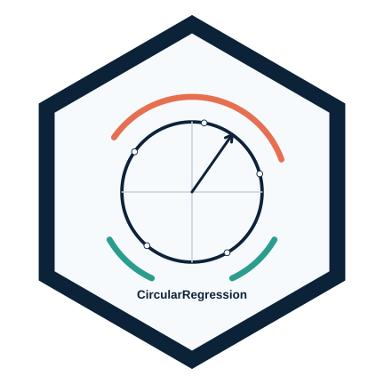

::: {.home-hero}
::: {.home-hero-copy}
# Aurélien Nicosia

## Applied statistics, data science, and university teaching

Lecturer in mathematics and statistics at Université Laval in Quebec City. I develop teaching resources, R packages, and statistical methods at the intersection of rigorous analysis, visualization, and active learning.

::: {.hero-actions}
[Teaching](enseignement.qmd){.btn .btn-outline-dark .btn-lg}
[Research](recherche.qmd){.btn .btn-outline-dark .btn-lg}
[R packages](packages.qmd){.btn .btn-outline-dark .btn-lg}
[Educational innovation](innovation.qmd){.btn .btn-outline-dark .btn-lg}
:::
:::

::: {.home-hero-visual}
::: {.home-hero-thumbs}

:::
:::
:::

## Updates and highlights

::: {.news-grid}

::: {.news-panel}
::: {.eyebrow}
Open teaching resources
:::

### Données bleues

Quebec and Canadian datasets for teaching statistics and R, with activities, source documentation and reusable teaching materials.

::: {.link-list}
[Explore the resources](https://aureliennicosiaulaval.github.io/donnees-bleues/){.btn .btn-outline-dark}
:::
:::

::: {.news-panel}
::: {.eyebrow}
R software
:::

### leaflet.indoor and lmmix

Two software projects available on GitHub: multi-level indoor maps and Gaussian mixed models with correlated residuals. Their development status is stated on each project page.

::: {.link-list}
[leaflet.indoor](packages/leaflet-indoor.qmd){.btn .btn-outline-dark}
[lmmix](packages/lmmix.qmd){.btn .btn-outline-dark}
:::
:::

::: {.news-panel}
::: {.eyebrow}
Teaching
:::

### Fall 2026 courses

Updated course sites for STT-1100, STT-4230 / STT-6230 and MQT-2101 bring together notes, activities and resources for reproducible data analysis.

::: {.link-list}
[Teaching](enseignement.qmd){.btn .btn-outline-dark}
:::
:::

::: {.news-panel}
::: {.eyebrow}
Seminar
:::

### Au-delà du prompt

Slides and a PDF from the September 18, 2026 OSD seminar on designing a teaching ecosystem with AI. Materials are in French.

::: {.link-list}
[Seminar resources](../presentations/au-dela-du-prompt/index.qmd){.btn .btn-outline-dark}
:::
:::

::: {.news-panel}
::: {.eyebrow}
Student support
:::

### GPT-CDA in ULaval News

On May 22, 2026, ULaval News published a story about GPT-CDA, a conversational assistant designed to support learning in mathematics and statistics at the CDA.

::: {.link-list}
[Read the article](https://nouvelles.ulaval.ca/2026/05/22/le-gpt-cda-un-robot-conversationnel-qui-epaule-les-etudiantes-et-etudiants-dans-les-cours-de-mathematiques-et-de-statistique-66c35c61-4649-41a0-befb-c2f79036ac30){.btn .btn-outline-dark}
[CDA page](cda/index.qmd){.btn .btn-outline-dark}
:::
:::

::: {.news-panel}
::: {.eyebrow}
R software
:::

### Recent packages on CRAN

`GLBFP`, `DonutMap`, `ggcircular`, `CircularRegression`, and `tutorizeR` support density estimation, statistical mapping, circular-data visualization, circular regression, and interactive tutorial creation.

::: {.link-list}
[DonutMap](packages/donutmap.qmd){.btn .btn-outline-dark}
[ggcircular](packages/ggcircular.qmd){.btn .btn-outline-dark}
[CircularRegression](packages/circularregression.qmd){.btn .btn-outline-dark}
[tutorizeR](packages/tutorizeR.qmd){.btn .btn-outline-dark}
:::
:::

::: {.news-panel}
::: {.eyebrow}
Presentations
:::

### SSC 2026

I led a workshop on AI and teaching, contributed to a public teaching-resource gallery, presented work on LOO-LBFP, and received the 2026 New Investigator Presentation Award.

::: {.link-list}
[AI Gallery](https://aureliennicosiaulaval.github.io/ssc-2026-ai-teaching-gallery/){.btn .btn-outline-dark}
[LOO-LBFP presentation](https://github.com/AurelienNicosiaULaval/ssc-2026-loo-lbfp-presentation/raw/main/main-beamer.pdf){.btn .btn-outline-dark}
:::
:::

::: {.news-panel}
::: {.eyebrow}
Publications
:::

### Animal movement

An article is published in Methods in Ecology and Evolution, and two bioRxiv preprints focus on behavioural-state inference and sequential predictive diagnostics for hidden Markov models of animal movement.

::: {.link-list}
[MEE article](https://doi.org/10.1111/2041-210X.70313){.btn .btn-outline-dark}
[HMM preprint](https://doi.org/10.64898/2026.07.07.737005){.btn .btn-outline-dark}
[SSF preprint](https://doi.org/10.64898/2026.02.05.704063){.btn .btn-outline-dark}
:::
:::
:::

## Site focus

::: {.feature-grid}
::: {.feature-panel}
### Teaching

Courses in statistics, data science, and R programming grounded in practice, reproducibility, and scientific communication.

[View courses](enseignement.qmd){.btn .btn-outline-dark}
:::

::: {.feature-panel}
### Research

Statistical methods for complex data, with emphasis on density estimation, multi-state models, circular data, and animal movement.

[View research areas](recherche.qmd){.btn .btn-outline-dark}
:::

::: {.feature-panel}
### Software and resources

R packages, Quarto platforms, interactive tutorials, and open material supporting reproducible research and data science teaching.

[Explore packages](packages.qmd){.btn .btn-outline-dark}
:::
:::

::: {.highlight-strip}
This website gathers my research, teaching, and pedagogical innovation activities. It emphasizes verifiable resources, links to repositories or publications, and materials that can be reused directly.
:::
