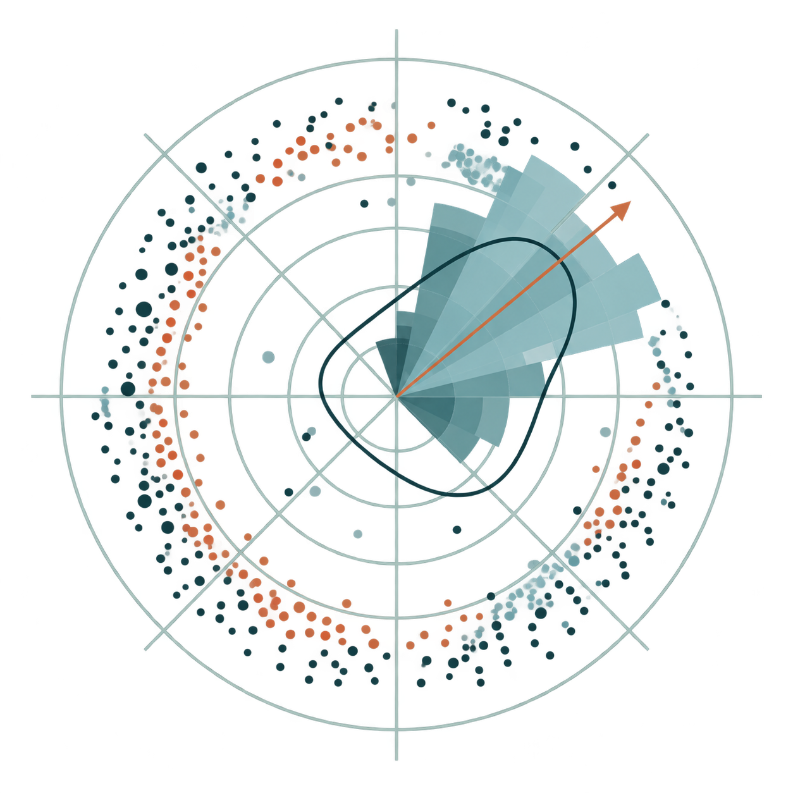
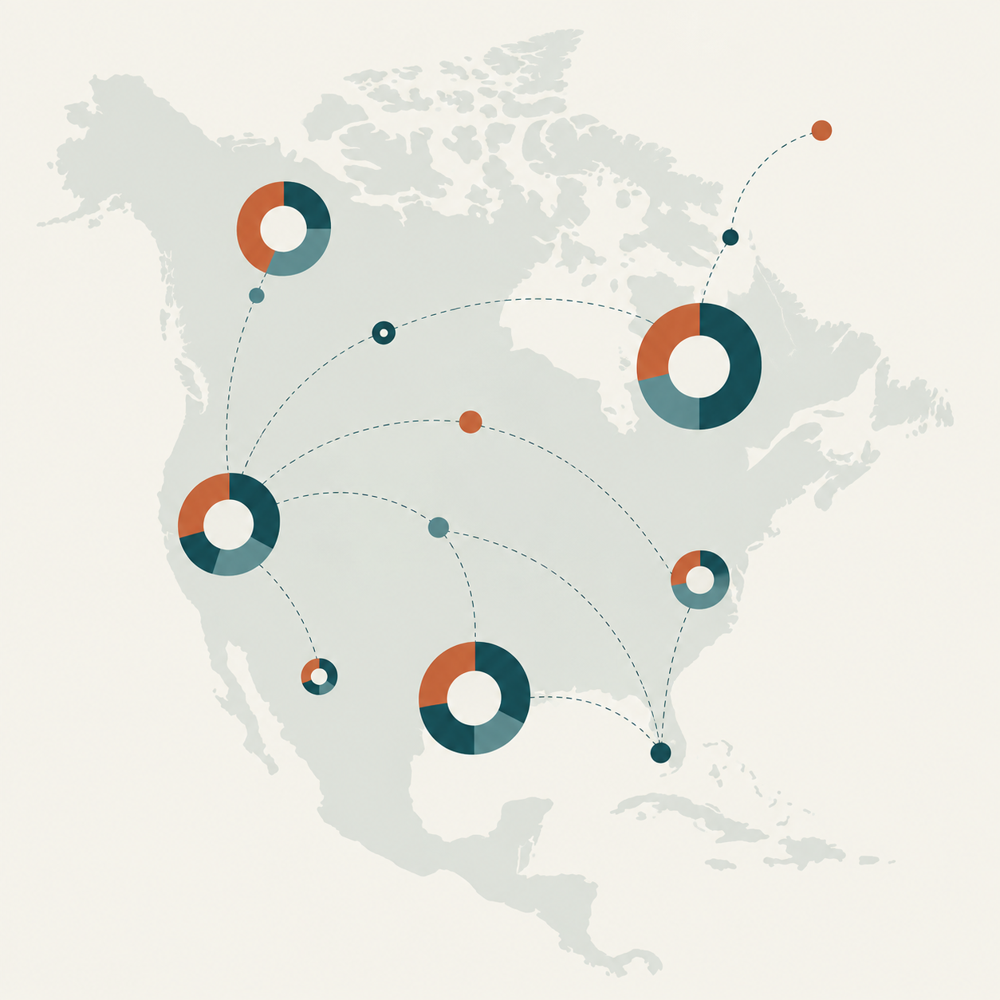
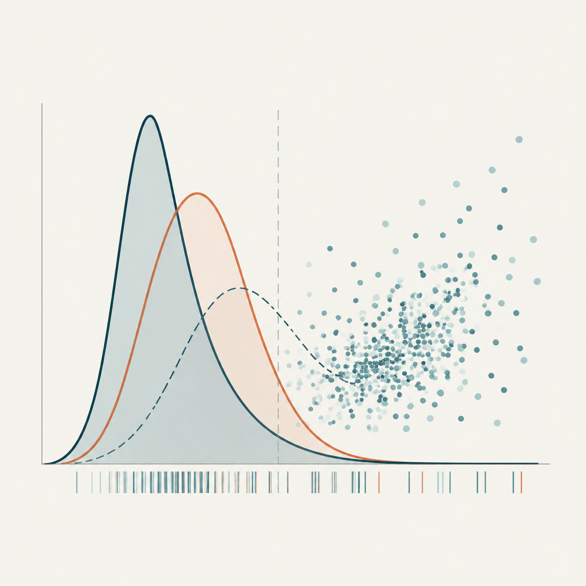

::: {.home-hero}
::: {.home-inner .home-hero-grid}
::: {.home-hero-copy}
<p class="home-kicker">UNIVERSITÉ LAVAL · QUÉBEC</p>
<h1 id="aurélien-nicosia"><span>Aurélien</span> <span>Nicosia</span></h1>
<p class="home-tagline">Statistics, data science and university teaching.</p>
<p class="home-description">Teaching at Université Laval.<br>Statistical methodology, R software and open resources.</p>

::: {.hero-actions}
[Explore my work <i class="bi bi-arrow-right" aria-hidden="true"></i>](recherche.qmd){.btn}
[View my background](cv/index.qmd){.text-link}
:::
:::

::: {.home-art}
<a class="hero-chart-link" href="packages/ggcircular.html" aria-label="ggcircular"></a>
[Circular data](packages/circularregression.qmd){.hero-topic .topic-circular}
[Density estimation](packages/glbfp.qmd){.hero-topic .topic-density}
[Sequential models](recherche.qmd){.hero-topic .topic-sequential}
<a class="hero-chart-detail" href="packages/ggcircular.html"><span>ggcircular</span><br>Visualizing circular data</a>
<span class="hero-chart-caption">Illustrative composition</span>
:::
:::
:::

::: {.home-inner .home-featured}
::: {.home-section-head}
## A selection of my work

[All projects <i class="bi bi-arrow-right" aria-hidden="true"></i>](research-lab.qmd)
:::

::: {.featured-grid}

```{=html}
<div class="featured-work">
<a href="packages/ggcircular.html"><div class="featured-visual"><span>Illustration</span></div><h3>ggcircular</h3><p>Visualizing circular data</p></a>
</div>
<div class="featured-work">
<a href="packages/donutmap.html"><div class="featured-visual"><span>Illustration</span></div><h3>DonutMap</h3><p>Mapping local compositions</p></a>
</div>
<div class="featured-work">
<a href="enseignement.html"><div class="featured-visual"><span>Illustration</span></div><h3>Teaching</h3><p>Learning statistics and R</p></a>
</div>
```

:::
:::

::: {.home-pathways}
::: {.home-inner .pathway-grid}
::: {}
## Teaching and student support

Courses, supervision and teaching innovation at Université Laval.

::: {.link-list}
[Courses and supervision](enseignement.qmd){.btn .btn-outline-dark}
[Teaching innovation](innovation.qmd){.btn .btn-outline-dark}
[CDA and GPT-CDA](cda/index.qmd){.btn .btn-outline-dark}
:::
:::
::: {}
## Explore and reuse

Datasets, teaching materials and a library to explore.

::: {.link-list}
[Library](library.qmd){.btn .btn-outline-dark}
[Open resources](ressources.qmd){.btn .btn-outline-dark}
:::
:::
:::
:::

::: {.home-inner .home-reading}

## Computational statistics, diagnostics and uncertainty {.home-context-title}

I hold a PhD in Statistics and a permanent teaching appointment at Université Laval. I develop methods for understanding latent states, directional data and atypical observations, connecting statistical methodology, R software and university teaching.

## Research, teaching and software

::: {.feature-grid}
::: {.feature-panel}
### A connected research program

Three themes: sequential model diagnostics, directional statistics and influence in density estimation. Methods are accompanied by simulation studies and reproducible materials.

[Contributions and directions](recherche.qmd){.btn .btn-outline-dark}
:::
::: {.feature-panel}
### Teaching and student training

Undergraduate and graduate teaching in French and English, student project advising and coordination of academic support through the CDA.

[Courses and supervision](enseignement.qmd){.btn .btn-outline-dark}
:::
::: {.feature-panel}
### Open software and resources

R packages on CRAN, software under development and teaching resources that make methods accessible and analyses verifiable.

[Software and documentation](packages.qmd){.btn .btn-outline-dark}
:::
:::

## Updates and highlights

::: {.news-grid}

::: {.news-panel}
::: {.eyebrow}
Publication · October 1, 2026
:::

### Visualizing directional dependence

My article *Visualizing directional dependence on cylinders and tori* is published in the *Journal of Data Science, Statistics, and Visualisation*, 6(7). It presents a conditional graphical grammar for data on cylinders and tori, implemented in ggcircular.

::: {.link-list}
[Read the article](https://doi.org/10.52933/jdssv.v6i7.181){.btn .btn-outline-dark}
[ggcircular](packages/ggcircular.qmd){.btn .btn-outline-dark}
:::
:::

::: {.news-panel}
::: {.eyebrow}
Publications
:::

### Animal movement

An article is published in Methods in Ecology and Evolution, and two bioRxiv preprints focus on behavioural-state inference and sequential predictive diagnostics for hidden Markov models of animal movement.

::: {.link-list}
[MEE article](https://doi.org/10.1111/2041-210X.70313){.btn .btn-outline-dark}
[HMM preprint](https://doi.org/10.64898/2026.07.07.737005){.btn .btn-outline-dark}
[SSF preprint](https://doi.org/10.64898/2026.02.05.704063){.btn .btn-outline-dark}
:::
:::

::: {.news-panel}
::: {.eyebrow}
Presentations
:::

### SSC 2026

I led a workshop on AI and teaching, contributed to a public teaching-resource gallery, presented work on LOO-LBFP, and received the 2026 New Investigator Presentation Award.

::: {.link-list}
[AI Gallery](https://aureliennicosiaulaval.github.io/ssc-2026-ai-teaching-gallery/){.btn .btn-outline-dark}
[LOO-LBFP presentation](https://github.com/AurelienNicosiaULaval/ssc-2026-loo-lbfp-presentation/raw/main/main-beamer.pdf){.btn .btn-outline-dark}
:::
:::

::: {.news-panel}
::: {.eyebrow}
Open teaching resources
:::

### Données bleues

Quebec and Canadian datasets for teaching statistics and R, with activities, source documentation and reusable teaching materials.

::: {.link-list}
[Explore the resources](https://aureliennicosiaulaval.github.io/donnees-bleues/){.btn .btn-outline-dark}
:::
:::

::: {.news-panel}
::: {.eyebrow}
R software
:::

### leaflet.indoor and lmmix

Two software projects available on GitHub: multi-level indoor maps and Gaussian mixed models with correlated residuals. Their development status is stated on each project page.

::: {.link-list}
[leaflet.indoor](packages/leaflet-indoor.qmd){.btn .btn-outline-dark}
[lmmix](packages/lmmix.qmd){.btn .btn-outline-dark}
:::
:::

::: {.news-panel}
::: {.eyebrow}
Teaching
:::

### Fall 2026 courses

Updated course sites for STT-1100, STT-4230 / STT-6230 and MQT-2101 bring together notes, activities and resources for reproducible data analysis.

::: {.link-list}
[Teaching](enseignement.qmd){.btn .btn-outline-dark}
:::
:::

::: {.news-panel}
::: {.eyebrow}
Seminar
:::

### Au-delà du prompt

Slides and a PDF from the September 18, 2026 OSD seminar on designing a teaching ecosystem with AI. Materials are in French.

::: {.link-list}
[Seminar resources](../presentations/au-dela-du-prompt/index.qmd){.btn .btn-outline-dark}
:::
:::

::: {.news-panel}
::: {.eyebrow}
Student support
:::

### GPT-CDA in ULaval News

On May 22, 2026, ULaval News published a story about GPT-CDA, a conversational assistant designed to support learning in mathematics and statistics at the CDA.

::: {.link-list}
[Read the article](https://nouvelles.ulaval.ca/2026/05/22/le-gpt-cda-un-robot-conversationnel-qui-epaule-les-etudiantes-et-etudiants-dans-les-cours-de-mathematiques-et-de-statistique-66c35c61-4649-41a0-befb-c2f79036ac30){.btn .btn-outline-dark}
[CDA page](cda/index.qmd){.btn .btn-outline-dark}
:::
:::

::: {.news-panel}
::: {.eyebrow}
R software
:::

### Recent packages on CRAN

`GLBFP`, `DonutMap`, `ggcircular`, `CircularRegression`, and `tutorizeR` support density estimation, statistical mapping, circular-data visualization, circular regression, and interactive tutorial creation.

::: {.link-list}
[DonutMap](packages/donutmap.qmd){.btn .btn-outline-dark}
[ggcircular](packages/ggcircular.qmd){.btn .btn-outline-dark}
[CircularRegression](packages/circularregression.qmd){.btn .btn-outline-dark}
[tutorizeR](packages/tutorizeR.qmd){.btn .btn-outline-dark}
:::
:::

:::

::: {.highlight-strip}
[Read the academic CV](cv/index.qmd): experience, publications, software, teaching, supervision, funding and service. PDF versions in French and English.
:::

:::
