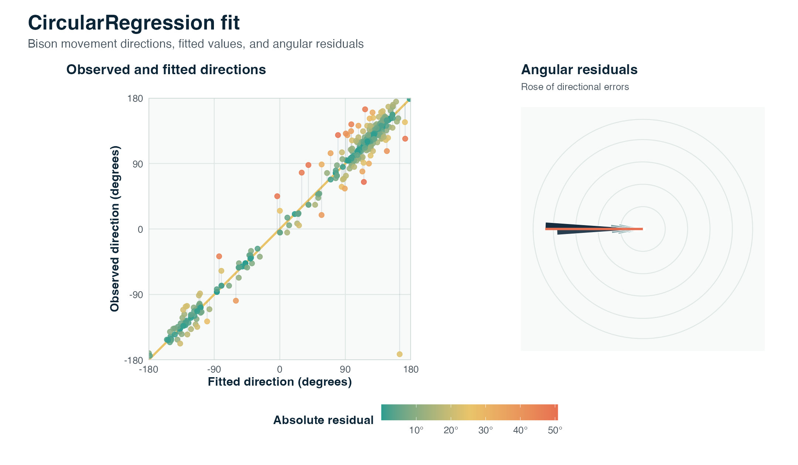

::: {.package-hero}
::: {}
`CircularRegression` is an R package for fitting regression models when the response is circular, such as a movement direction or an angle measured in radians. It implements homogeneous angular regression, consensus angular regression, a two-step workflow, selected model-specific interfaces, and a random-intercept extension for clustered circular responses.

CRAN version: 0.5.1, published on June 10, 2026.

::: {.link-list}
[CRAN](https://cran.r-project.org/package=CircularRegression){.btn .btn-outline-dark .rounded-pill .shadow-sm}
[GitHub](https://github.com/AurelienNicosiaULaval/CircularRegression){.btn .btn-outline-dark .rounded-pill .shadow-sm}
[CRAN vignette](https://cran.r-project.org/web/packages/CircularRegression/vignettes/angular-regression-workflow.html){.btn .btn-outline-dark .rounded-pill .shadow-sm}
[Methodological reference](https://doi.org/10.1111/rssc.12124){.btn .btn-outline-dark .rounded-pill .shadow-sm}
:::
:::

{fig-alt="CircularRegression hex logo" fig-cap="CircularRegression hex logo" .package-logo}
:::

## Visual preview

The illustration below is produced from the `bison` data included in the package. The left panel compares observed directions with model-fitted directions, and the right panel summarizes angular residuals.

{fig-alt="Illustration of a CircularRegression fit on bison movement directions." fig-cap="Illustration of a CircularRegression fit on bison movement directions." .package-example}

## Usage example

The code below fits a circular regression model to the `bison` data included in the package. Formula syntax can use directional variables directly, or directions weighted by a non-negative modifier with the `x:z` form.

```r
# Load library
library(CircularRegression)

# Prepare example data
data(bison)
d <- bison[seq_len(100), ]

# Fit a circular regression model
fit <- circular_regression(
  y.dir ~ y.prec + x.meadow:z.meadow,
  data = d
)

# Inspect the fitted model
summary(fit)
coef(fit)
head(predict(fit))
```

## What is CircularRegression for?

- modeling angular or directional responses;
- fitting homogeneous angular regression or consensus angular regression models;
- using a two-step workflow that connects consensus and homogeneous models;
- analyzing clustered circular responses with a random-intercept extension;
- producing diagnostics, predictions, residuals, information criteria, and summaries adapted to circular models.
