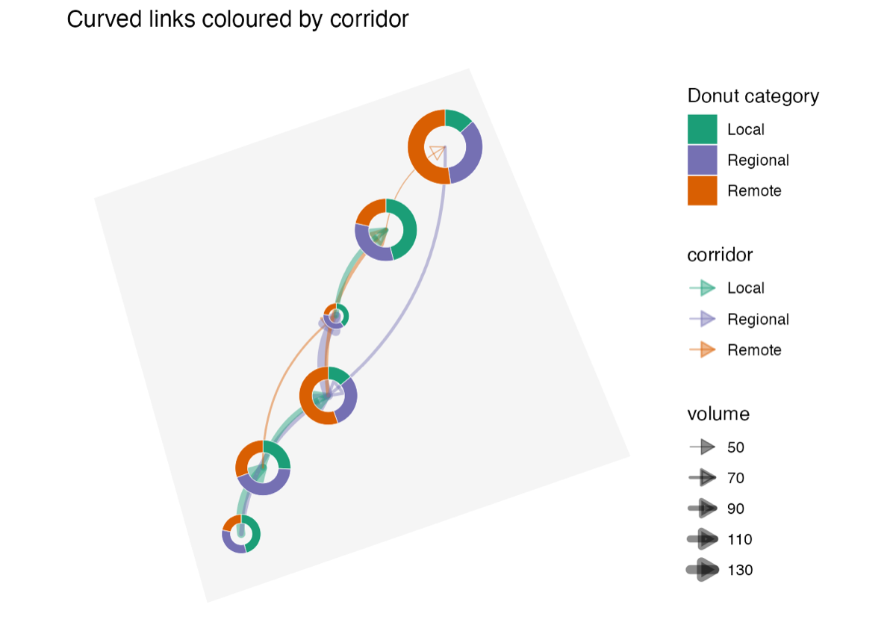

::: {.package-hero}
::: {}
`DonutMap` is an R package for representing local compositions as donut charts positioned on a map. It provides functions for static `ggplot2` maps, interactive `leaflet` maps, `sf` polygon layers, and origin-destination flow lines.

CRAN version: 0.1.0, published on June 8, 2026.

::: {.link-list}
[CRAN](https://cran.r-project.org/web/packages/DonutMap/index.html){.btn .btn-outline-dark .rounded-pill .shadow-sm}
[GitHub](https://github.com/AurelienNicosiaULaval/DonutMap){.btn .btn-outline-dark .rounded-pill .shadow-sm}
[Documentation](https://aureliennicosiaulaval.github.io/DonutMap/){.btn .btn-outline-dark .rounded-pill .shadow-sm}
[Vignette](https://aureliennicosiaulaval.github.io/DonutMap/articles/donut-maps.html){.btn .btn-outline-dark .rounded-pill .shadow-sm}
:::
:::

{fig-alt="DonutMap hex logo" fig-cap="DonutMap hex logo" .package-logo}
:::

## Visual preview

The image below comes from the package example gallery and shows a static map with curved links and arrows.

{fig-alt="Example DonutMap map with curved links coloured by corridor." fig-cap="Example DonutMap map with curved links coloured by corridor." .package-example}

## Usage example

The code below creates donut charts by site and adds flows between sites. The data are simulated to illustrate the structure expected by the package.

```r
# Load libraries
library(DonutMap)
library(ggplot2)

# Create example data
demo <- data.frame(
  place = rep(c("A", "B", "C"), each = 3),
  lon = rep(c(-71.35, -71.20, -71.05), each = 3),
  lat = rep(c(46.75, 46.82, 46.73), each = 3),
  category = rep(c("Walking", "Transit", "Car"), times = 3),
  value = c(10, 20, 5, 5, 15, 10, 12, 4, 9)
)

flows <- data.frame(
  from = c("A", "B"),
  to = c("B", "C"),
  trips = c(30, 10),
  flow_category = c("Transit", "Car")
)

mode_colours <- c(
  Walking = "#1b9e77",
  Transit = "#7570b3",
  Car = "#d95f02"
)

# Draw a static donut map
donut_map(
  demo,
  place,
  category,
  value,
  lon = lon,
  lat = lat,
  flows = flows,
  from = from,
  to = to,
  flow_value = trips,
  flow_group = flow_category,
  flow_colours = mode_colours,
  flow_curvature = 0.22,
  flow_arrow = TRUE,
  colours = mode_colours
)
```

## What is DonutMap for?

- comparing local compositions on a map;
- visualizing flows between locations with straight or curved trajectories;
- producing either a static `ggplot2` map or an interactive `leaflet` map;
- keeping a tidy-data interface compatible with reproducible workflows.
