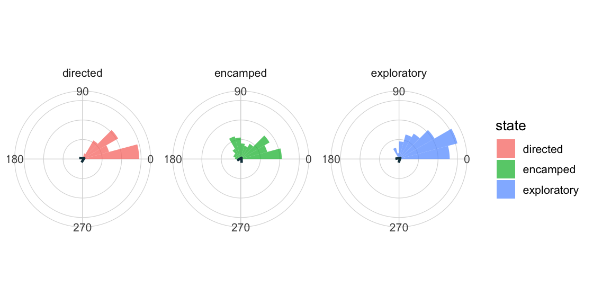

::: {.package-hero}
::: {}
`ggcircular` is a `ggplot2` extension for visualizing circular, axial, and directional data. The package provides geoms, stats, scales, and themes for angles, orientations, times of day, movement directions, and circular distributions.

CRAN version: 0.1.0, published on June 4, 2026.

::: {.link-list}
[CRAN](https://cran.r-project.org/web/packages/ggcircular/index.html){.btn .btn-outline-dark .rounded-pill .shadow-sm}
[GitHub](https://github.com/AurelienNicosiaULaval/ggcircular){.btn .btn-outline-dark .rounded-pill .shadow-sm}
[Documentation](https://aureliennicosiaulaval.github.io/ggcircular/){.btn .btn-outline-dark .rounded-pill .shadow-sm}
[Reference](https://aureliennicosiaulaval.github.io/ggcircular/reference/index.html){.btn .btn-outline-dark .rounded-pill .shadow-sm}
:::
:::

{fig-alt="ggcircular hex logo" fig-cap="ggcircular hex logo" .package-logo}
:::

## Visual preview

::: {.package-gallery}
{.package-example}
{.package-example}
:::

## Usage example

The code below follows the package quick start: it displays winter wind directions with a rose diagram, a circular density estimate, and a mean direction.

```r
# Load libraries
library(ggplot2)
library(dplyr)
library(ggcircular)

# Plot winter wind directions
wind_directions |>
  filter(season == "winter") |>
  ggplot(aes(x = direction)) +
  geom_rose(
    aes(y = after_stat(density), fill = after_stat(density)),
    bins = 24,
    alpha = 0.78
  ) +
  geom_circular_density(linewidth = 1.1, colour = "#123C4A") +
  geom_mean_direction(
    length = "resultant",
    colour = "#E4572E",
    linewidth = 1.1
  ) +
  scale_x_circular_compass() +
  coord_circular(zero = "north", direction = "clockwise") +
  labs(fill = "density", title = "Winter wind directions") +
  theme_circular()
```

## What is ggcircular for?

- creating rose diagrams and circular histograms;
- estimating and displaying circular densities;
- showing mean directions, confidence arcs, and theoretical distributions;
- producing reproducible `ggplot2` graphics for periodic, axial, or directional data.
