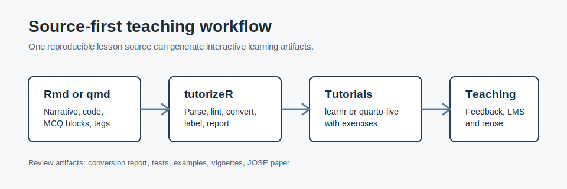
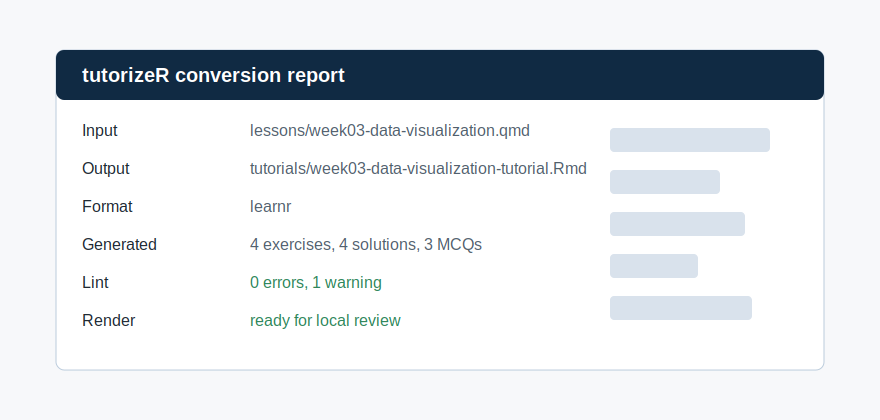

::: {.package-hero}
::: {}
`tutorizeR` is an R package for converting existing R Markdown (`.Rmd`) or Quarto (`.qmd`) teaching material into interactive tutorials for `learnr` or `quarto-live`. It lets instructors keep one primary lesson source while generating exercises, solutions, multiple-choice questions, and conversion reports.

CRAN version: 0.4.5, published on June 11, 2026.

::: {.link-list}
[CRAN](https://cran.r-project.org/web/packages/tutorizeR/index.html){.btn .btn-outline-dark .rounded-pill .shadow-sm}
[GitHub](https://github.com/AurelienNicosiaULaval/tutorizeR){.btn .btn-outline-dark .rounded-pill .shadow-sm}
[Getting started](https://cran.r-project.org/web/packages/tutorizeR/vignettes/getting-started.html){.btn .btn-outline-dark .rounded-pill .shadow-sm}
[CRAN vignettes](https://cran.r-project.org/web/packages/tutorizeR/index.html){.btn .btn-outline-dark .rounded-pill .shadow-sm}
:::
:::

{.package-logo}
:::

## Visual preview

These illustrations summarize the package workflow: one teaching source is converted into interactive tutorials and accompanied by an auditable conversion report.

::: {.package-gallery}
{.package-example}
{.package-example}
:::

## Usage example

The code below follows the package quick start. It copies the installed example module, loads a question bank, and converts a Quarto lesson into a `learnr` tutorial.

```r
# Load library
library(tutorizeR)

# Locate the installed example module
example_dir <- system.file(
  "examples",
  "example_course_module",
  package = "tutorizeR"
)

# Copy the lesson and data to a temporary working directory
work_dir <- file.path(tempdir(), "tutorizeR-example")
dir.create(work_dir, recursive = TRUE, showWarnings = FALSE)

file.copy(
  from = file.path(example_dir, "lesson-source.qmd"),
  to = work_dir,
  overwrite = TRUE
)

file.copy(
  from = file.path(example_dir, "student_activity.csv"),
  to = work_dir,
  overwrite = TRUE
)

# Load the reusable question bank
question_bank <- load_question_bank(
  file.path(example_dir, "question-bank")
)

# Convert the lesson to an interactive tutorial
report <- tutorize(
  input = file.path(work_dir, "lesson-source.qmd"),
  output_dir = work_dir,
  format = "learnr",
  assessment = "both",
  question_bank = question_bank,
  mcq_source = "mixed",
  overwrite = TRUE,
  verbose = FALSE
)

# Inspect the conversion report
print(report)
```

## What is tutorizeR for?

- converting `.Rmd` or `.qmd` lessons into interactive tutorials;
- turning existing code chunks into exercises, solutions, and feedback;
- integrating inline multiple-choice questions or YAML/JSON question banks;
- writing JSON or YAML conversion reports for review and reproducibility;
- processing a folder of lessons with a consistent conversion policy.
