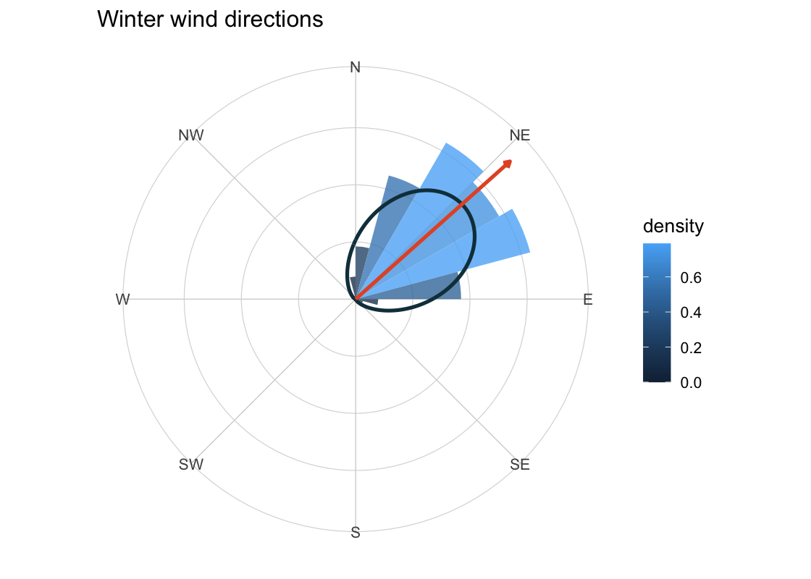
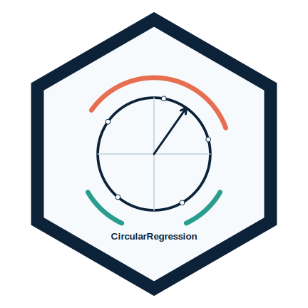

::: {.home-hero}
::: {.home-hero-copy}
## Statistique appliquée, R et pédagogie ouverte

Chargé d’enseignement en mathématiques et statistiques à l’Université Laval, à Québec. Je développe des ressources, des packages R et des méthodes statistiques pour relier analyse rigoureuse, visualisation et apprentissage actif.

::: {.hero-actions}
[Enseignement](enseignement.qmd){.btn .btn-outline-danger .rounded-pill .btn-lg .fw-bold}
[Recherche](recherche.qmd){.btn .btn-outline-dark .rounded-pill .btn-lg .fw-bold}
[Packages R](packages.qmd){.btn .btn-outline-dark .rounded-pill .btn-lg .fw-bold}
[Innovation pédagogique](innovation.qmd){.btn .btn-outline-warning .rounded-pill .btn-lg .fw-bold}
:::
:::

::: {.home-hero-visual}
::: {.home-hero-thumbs}

:::
:::
:::

## Nouveautés 2026

::: {.news-grid}
::: {.news-panel}
### GPT-CDA dans ULaval Nouvelles
Le 22 mai 2026, ULaval Nouvelles a consacré un article au GPT-CDA, un assistant conversationnel conçu pour soutenir l’apprentissage en mathématiques et en statistique au CDA.

::: {.link-list}
[Lire l’article](https://nouvelles.ulaval.ca/2026/05/22/le-gpt-cda-un-robot-conversationnel-qui-epaule-les-etudiantes-et-etudiants-dans-les-cours-de-mathematiques-et-de-statistique-66c35c61-4649-41a0-befb-c2f79036ac30){.btn .btn-outline-dark .rounded-pill .shadow-sm}
[Page CDA](cda/index.qmd){.btn .btn-outline-dark .rounded-pill .shadow-sm}
:::
:::

::: {.news-panel}
### Trois packages R récents sur CRAN
Les packages R `DonutMap`, `ggcircular` et `CircularRegression` sont disponibles sur le CRAN depuis juin 2026. Ils soutiennent la cartographie de diagrammes en anneau, la visualisation de données circulaires et la régression pour réponses circulaires.

::: {.link-list}
[DonutMap](packages/donutmap.qmd){.btn .btn-outline-dark .rounded-pill .shadow-sm}
[ggcircular](packages/ggcircular.qmd){.btn .btn-outline-dark .rounded-pill .shadow-sm}
[CircularRegression](packages/circularregression.qmd){.btn .btn-outline-dark .rounded-pill .shadow-sm}
[Tous les packages](packages.qmd){.btn .btn-outline-dark .rounded-pill .shadow-sm}
:::
:::

::: {.news-panel}
### SSC 2026
J’ai animé un atelier sur l’IA et l’enseignement, contribué à une galerie publique de ressources pédagogiques, présenté des travaux sur LOO-LBFP, et reçu le prix 2026 de la présentation par un nouveau chercheur.

::: {.link-list}
[AI Gallery](https://aureliennicosiaulaval.github.io/ssc-2026-ai-teaching-gallery/){.btn .btn-outline-dark .rounded-pill .shadow-sm}
[Présentation LOO-LBFP](https://github.com/AurelienNicosiaULaval/ssc-2026-loo-lbfp-presentation/raw/main/main-beamer.pdf){.btn .btn-outline-dark .rounded-pill .shadow-sm}
:::
:::

::: {.news-panel}
### Publications en mouvement animal
Un nouvel article est publié dans *Methods in Ecology and Evolution* et une prépublication bioRxiv porte sur l’inférence des états comportementaux à partir de fonctions de sélection de pas markoviennes.

::: {.link-list}
[Article MEE](https://doi.org/10.1111/2041-210X.70313){.btn .btn-outline-dark .rounded-pill .shadow-sm}
[Prépublication bioRxiv](https://doi.org/10.64898/2026.02.05.704063){.btn .btn-outline-dark .rounded-pill .shadow-sm}
:::
:::
:::

## À l’affiche

::: {.feature-grid}
::: {.feature-panel}
### Thèse de doctorat
Modèles multi-états pour l’analyse du mouvement animalier.

[Consulter le PDF](https://corpus.ulaval.ca/server/api/core/bitstreams/cf3426a4-3475-4d48-a4c4-de29df846ed5/content){.btn .btn-outline-dark .rounded-pill .shadow-sm}

[Code et matériel](https://github.com/AurelienNicosiaULaval/multi-state-model-animal-movement){.btn .btn-outline-dark .rounded-pill .shadow-sm}
:::

::: {.feature-panel}
### Packages R
Ensemble de packages R développés pour la statistique appliquée.

[DonutMap](packages/donutmap.qmd){.btn .btn-outline-dark .rounded-pill .shadow-sm}

[GLBFP](https://github.com/AurelienNicosiaULaval/GLBFP){.btn .btn-outline-dark .rounded-pill .shadow-sm}

[CircularRegression](packages/circularregression.qmd){.btn .btn-outline-dark .rounded-pill .shadow-sm}

[ggcircular](packages/ggcircular.qmd){.btn .btn-outline-dark .rounded-pill .shadow-sm}

[GeneralOaxaca (CRAN)](https://cran.r-project.org/web/packages/GeneralOaxaca/index.html){.btn .btn-outline-dark .rounded-pill .shadow-sm}

[Voir tous les packages](packages.qmd){.btn .btn-outline-dark .rounded-pill .shadow-sm}
:::

::: {.feature-panel}
### Ressources ouvertes
Plateforme de ressources, tutoriels et outils pédagogiques.

[site_ressources_SSD](https://aureliennicosiaulaval.github.io/site_ressources_SSD/){.btn .btn-outline-dark .rounded-pill .shadow-sm}

[tutorizeR](https://github.com/AurelienNicosiaULaval/tutorizeR){.btn .btn-outline-dark .rounded-pill .shadow-sm}

[ZeroWasteData](https://github.com/AurelienNicosiaULaval/ZeroWasteData){.btn .btn-outline-dark .rounded-pill .shadow-sm}
:::
:::

## Accès rapide

- Enseignement : plans, notes et devoirs → [Enseignement](enseignement.qmd)
- Recherche : axes, logiciels, thèse → [Recherche](recherche.qmd)
- Innovation pédagogique : projets et ressources → [Innovation pédagogique](innovation.qmd)
- À propos / contact → [À propos](a-propos.qmd)
- CV complet → [cv](cv/index.qmd)
