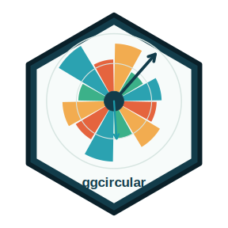

Cette page rassemble les packages R que je développe et maintiens, avec une attention particulière aux packages disponibles sur le CRAN et accompagnés d’une documentation ouverte.

Les informations CRAN ci-dessous ont été vérifiées le 24 juin 2026 à partir des fichiers `DESCRIPTION` officiels du CRAN.

## Packages sur le CRAN

::: { .grid .gap-4 }
::: {.g-col-12 .g-col-lg-6}
::: {.package-card}

<h3>tutorizeR</h3>

Conversion de matériel pédagogique `.Rmd` ou `.qmd` en tutoriels interactifs pour `learnr` ou `quarto-live`, avec rapports de conversion, tags enseignants et banques de questions.

Version CRAN : 0.4.5, publiée le 11 juin 2026.

::: {.link-list}
[Page dédiée](packages/tutorizeR.qmd){.btn .btn-outline-dark .rounded-pill .shadow-sm}
[CRAN](https://cran.r-project.org/web/packages/tutorizeR/index.html){.btn .btn-outline-dark .rounded-pill .shadow-sm}
[GitHub](https://github.com/AurelienNicosiaULaval/tutorizeR){.btn .btn-outline-dark .rounded-pill .shadow-sm}
[Vignette](https://cran.r-project.org/web/packages/tutorizeR/vignettes/getting-started.html){.btn .btn-outline-dark .rounded-pill .shadow-sm}
:::
:::
:::

::: {.g-col-12 .g-col-lg-6}
::: {.package-card}

<h3>DonutMap</h3>

Cartes en anneaux avec `sf`, `ggplot2` et `leaflet`. Le package permet de placer des diagrammes en anneau sur des cartes statiques ou interactives et d’ajouter des flux origine-destination.

Version CRAN : 0.1.0, publiée le 8 juin 2026.

::: {.link-list}
[Page dédiée](packages/donutmap.qmd){.btn .btn-outline-dark .rounded-pill .shadow-sm}
[CRAN](https://cran.r-project.org/web/packages/DonutMap/index.html){.btn .btn-outline-dark .rounded-pill .shadow-sm}
[GitHub](https://github.com/AurelienNicosiaULaval/DonutMap){.btn .btn-outline-dark .rounded-pill .shadow-sm}
[Documentation](https://aureliennicosiaulaval.github.io/DonutMap/){.btn .btn-outline-dark .rounded-pill .shadow-sm}
:::
:::
:::

::: {.g-col-12 .g-col-lg-6}
::: {.package-card}

<h3>ggcircular</h3>

Extension `ggplot2` pour données circulaires, axiales et directionnelles : diagrammes de rose, densités circulaires, directions moyennes, arcs de confiance et visualisations de mouvement.

Version CRAN : 0.1.0, publiée le 4 juin 2026.

::: {.link-list}
[Page dédiée](packages/ggcircular.qmd){.btn .btn-outline-dark .rounded-pill .shadow-sm}
[CRAN](https://cran.r-project.org/web/packages/ggcircular/index.html){.btn .btn-outline-dark .rounded-pill .shadow-sm}
[GitHub](https://github.com/AurelienNicosiaULaval/ggcircular){.btn .btn-outline-dark .rounded-pill .shadow-sm}
[Documentation](https://aureliennicosiaulaval.github.io/ggcircular/){.btn .btn-outline-dark .rounded-pill .shadow-sm}
:::
:::
:::

::: {.g-col-12 .g-col-lg-6}
::: {.package-card}

<h3>CircularRegression</h3>

Modèles de régression pour réponses circulaires : régression angulaire homogène, consensus angulaire, workflow en deux étapes et extension à effet aléatoire pour réponses circulaires groupées.

Version CRAN : 0.5.1, publiée le 10 juin 2026.

::: {.link-list}
[Page dédiée](packages/circularregression.qmd){.btn .btn-outline-dark .rounded-pill .shadow-sm}
[CRAN](https://cran.r-project.org/package=CircularRegression){.btn .btn-outline-dark .rounded-pill .shadow-sm}
[GitHub](https://github.com/AurelienNicosiaULaval/CircularRegression){.btn .btn-outline-dark .rounded-pill .shadow-sm}
[Vignette](https://cran.r-project.org/web/packages/CircularRegression/vignettes/angular-regression-workflow.html){.btn .btn-outline-dark .rounded-pill .shadow-sm}
:::
:::
:::

::: {.g-col-12 .g-col-lg-6}
::: {.package-card}

GO
<h3>GeneralOaxaca</h3>

Décomposition de Blinder-Oaxaca pour modèles linéaires généralisés, avec erreurs-types bootstrap et sorties pour décompositions en deux et trois composantes.

Version CRAN : 1.0, publiée le 17 août 2015.

::: {.link-list}
[CRAN](https://cran.r-project.org/web/packages/GeneralOaxaca/index.html){.btn .btn-outline-dark .rounded-pill .shadow-sm}
:::
:::
:::
:::

## Projets GitHub liés

Les vignettes ci-dessous présentent des packages et compendiums R publics hébergés sur mon GitHub, mais non listés dans la section CRAN ci-dessus.

::: { .grid .gap-4 }
::: {.g-col-12 .g-col-lg-6}
::: {.package-card .github-package-card}

GL

<h3>GLBFP</h3>

Package R • v0.5.1

Estimation de densité

Estimateurs ASH, LBFP et GLBFP pour l’estimation non paramétrique de densité, avec grilles, calculs clairsemés, scores leave-one-out et outils de visualisation.

::: {.link-list}
[GitHub](https://github.com/AurelienNicosiaULaval/GLBFP){.btn .btn-outline-dark .rounded-pill .shadow-sm}
[Documentation](https://aureliennicosiaulaval.github.io/GLBFP/){.btn .btn-outline-dark .rounded-pill .shadow-sm}
:::
:::
:::

::: {.g-col-12 .g-col-lg-6}
::: {.package-card .github-package-card}

LT

<h3>learnrTrackR</h3>

Package R • v0.3.0

Enseignement interactif

Suivi des tentatives dans des tutoriels de style `learnr`, stockage SQLite ou PostgreSQL, résumés de scores, exports Moodle et rapports pédagogiques.

::: {.link-list}
[GitHub](https://github.com/AurelienNicosiaULaval/learnrTrackR){.btn .btn-outline-dark .rounded-pill .shadow-sm}
[Documentation](https://aureliennicosiaulaval.github.io/learnrTrackR/){.btn .btn-outline-dark .rounded-pill .shadow-sm}
:::
:::
:::

::: {.g-col-12 .g-col-lg-6}
::: {.package-card .github-package-card}

GM

<h3>gmov</h3>

Package R • v0.0.0.9000

Mouvement animalier

Diagnostics de validation générative au niveau des trajectoires pour modèles SSF et iSSF, en comparant trajectoires observées et simulées.

::: {.link-list}
[GitHub](https://github.com/AurelienNicosiaULaval/gmov){.btn .btn-outline-dark .rounded-pill .shadow-sm}
[Documentation](https://aureliennicosiaulaval.github.io/gmov/){.btn .btn-outline-dark .rounded-pill .shadow-sm}
:::
:::
:::

::: {.g-col-12 .g-col-lg-6}
::: {.package-card .github-package-card}

CR

<h3>contextR</h3>

Package R • v0.2.0

Interprétation statistique

API S3 pour extraire des résultats statistiques structurés, construire des prompts et produire des explications contextualisées avec contrôles de validation.

::: {.link-list}
[GitHub](https://github.com/AurelienNicosiaULaval/contextR){.btn .btn-outline-dark .rounded-pill .shadow-sm}
:::
:::
:::

::: {.g-col-12 .g-col-lg-6}
::: {.package-card .github-package-card}

UL

<h3>UlavalSSD</h3>

Package R • v0.2.0

Données pédagogiques

Données et fonctions utiles pour l’enseignement de l’introduction à la science des données à l’Université Laval.

::: {.link-list}
[GitHub](https://github.com/AurelienNicosiaULaval/UlavalSSD){.btn .btn-outline-dark .rounded-pill .shadow-sm}
:::
:::
:::

::: {.g-col-12 .g-col-lg-6}
::: {.package-card .github-package-card}

EH

<h3>evalue-HMM</h3>

Package R • v0.1.0

Diagnostics prédictifs

Diagnostics prédictifs par e-valeurs pour modèles de Markov cachés appliqués aux données de mouvement animalier.

::: {.link-list}
[GitHub](https://github.com/AurelienNicosiaULaval/evalue-HMM){.btn .btn-outline-dark .rounded-pill .shadow-sm}
[Documentation](https://aureliennicosiaulaval.github.io/evalue-HMM/){.btn .btn-outline-dark .rounded-pill .shadow-sm}
:::
:::
:::
:::

## Contributions open source externes

Ces contributions concernent des packages maintenus dans d’autres organisations ou comptes GitHub.

::: { .grid .gap-4 }
::: {.g-col-12 .g-col-lg-6}
::: {.package-card .github-package-card}

AM

<h3>amt</h3>

Package R • contribution externe

Movement ecology

Contribution au package R `amt` avec le PR `#142`, “Add generative validation diagnostics”, fusionné le 23 juin 2026 dans `jmsigner/amt`.

::: {.link-list}
[Package amt](https://github.com/jmsigner/amt){.btn .btn-outline-dark .rounded-pill .shadow-sm}
[PR #142](https://github.com/jmsigner/amt/pull/142){.btn .btn-outline-dark .rounded-pill .shadow-sm}
:::
:::
:::
:::
