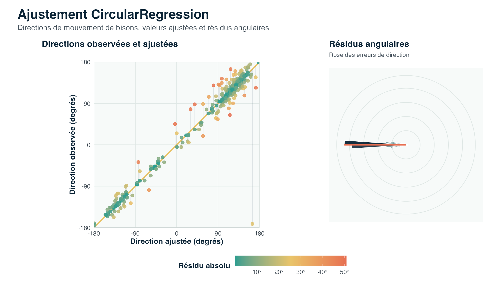

::: {.package-hero}
::: {}
`CircularRegression` est un package R pour ajuster des modèles de régression lorsque la variable réponse est circulaire, par exemple une direction de mouvement ou un angle mesuré en radians. Il implémente des modèles de régression angulaire homogène, de consensus angulaire, un workflow en deux étapes, des interfaces spécialisées et une extension avec effet aléatoire pour réponses circulaires groupées.

Version CRAN : 0.5.1, publiée le 10 juin 2026.

::: {.link-list}
[CRAN](https://cran.r-project.org/package=CircularRegression){.btn .btn-outline-dark .rounded-pill .shadow-sm}
[GitHub](https://github.com/AurelienNicosiaULaval/CircularRegression){.btn .btn-outline-dark .rounded-pill .shadow-sm}
[Vignette CRAN](https://cran.r-project.org/web/packages/CircularRegression/vignettes/angular-regression-workflow.html){.btn .btn-outline-dark .rounded-pill .shadow-sm}
[Référence méthodologique](https://doi.org/10.1111/rssc.12124){.btn .btn-outline-dark .rounded-pill .shadow-sm}
:::
:::

{.package-logo}
:::

## Aperçu visuel

L’illustration ci-dessous est produite à partir des données `bison` incluses dans le package. Le panneau de gauche compare les directions observées aux directions ajustées par le modèle ; le panneau de droite résume les résidus angulaires.

{.package-example}

## Exemple d’utilisation

Le code suivant ajuste un modèle de régression circulaire sur les données `bison` incluses dans le package. La syntaxe de formule permet d’utiliser des variables directionnelles directement, ou des directions pondérées par un modificateur non négatif avec la forme `x:z`.

```r
# Load library
library(CircularRegression)

# Prepare example data
data(bison)
d <- bison[seq_len(100), ]

# Fit a circular regression model
fit <- circular_regression(
  y.dir ~ y.prec + x.meadow:z.meadow,
  data = d
)

# Inspect the fitted model
summary(fit)
coef(fit)
head(predict(fit))
```

## À quoi sert CircularRegression ?

- modéliser des réponses angulaires ou directionnelles ;
- ajuster des modèles de régression angulaire homogène ou de consensus ;
- utiliser un workflow en deux étapes pour relier modèle de consensus et modèle homogène ;
- analyser des réponses circulaires groupées avec une extension à effet aléatoire ;
- produire des diagnostics, prédictions, résidus, critères d’information et résumés adaptés aux modèles circulaires.
